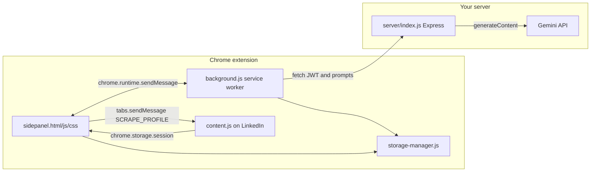
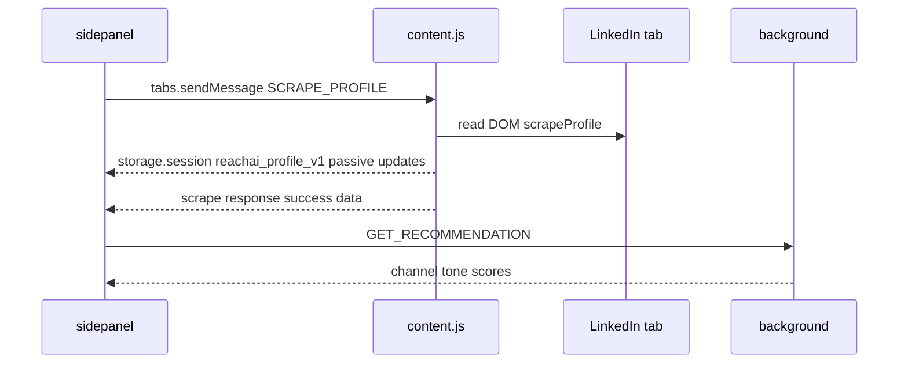

# LynkWell AI — how the codebase works

This document describes the LynkWell AI repository: a Chrome MV3 extension plus a small Node/Express API. The extension scrapes LinkedIn in-page, stores context locally, and sends prompts to your backend; the server holds the Gemini API key and returns model text.

## High-level architecture

- **Gemini never runs in the extension** — only on [server/index.js](../server/index.js) via `POST /api/v1/ai/complete`.
- **JWT** is obtained from your server (`ACTIVATE_CLOUD` / auth activate); [extension/background.js](../extension/background.js) `callAi()` sends `Authorization: Bearer <token>` with each AI request.

---

## Directory layout

| Path | Role |
|------|------|
| [extension/manifest.json](../extension/manifest.json) | MV3: `side_panel`, `background` service worker, `content_scripts` on LinkedIn `/in/*` and messaging, `host_permissions` for LinkedIn + your API |
| [extension/background.js](../extension/background.js) | Message hub: activate session, LinkedIn OAuth start/clear, `GET_RECOMMENDATION`, `GENERATE_NOTE`, `GENERATE_NOTE_AGENT`, `CONFIRM_IDENTITY`, `ENHANCE_MISSION`; builds prompts; `fetch` to your API |
| [extension/sidepanel.js](../extension/sidepanel.js) | All UI logic: screens, `scanProfile`, `getRecommendation`, `generateNote`, feedback, live generate status, storage-driven setup |
| [extension/sidepanel.html](../extension/sidepanel.html) / [extension/sidepanel.css](../extension/sidepanel.css) | Panel markup and styling |
| [extension/content.js](../extension/content.js) | DOM scrape on LinkedIn; passive debounced writes to `chrome.storage.session`; responds to `SCRAPE_PROFILE`, `FETCH_PROFILE_PHOTO`, `PING` |
| [extension/lib/storage-manager.js](../extension/lib/storage-manager.js) | `chrome.storage.local`: identity, settings/mission, training files/text, feedback, cloud session, daily count, LinkedIn OAuth, etc. |
| [extension/lib/reach-api-default.js](../extension/lib/reach-api-default.js) | Bundled defaults: API base URL, activation code / extension secret, LinkedIn client id flags, optional feature toggles |
| [extension/lib/channel-limits.js](../extension/lib/channel-limits.js) | Character limits for connect / DM / InMail (used in prompts) |
| [extension/lib/file-parser.js](../extension/lib/file-parser.js) | Parses uploaded training files (.txt, .pdf, etc.) for the knowledge base |
| [extension/lib/gemini-config.js](../extension/lib/gemini-config.js) | Legacy / optional client config (product uses server-side Gemini) |
| [server/index.js](../server/index.js) | Express: JWT activate, `ai/complete` → Gemini, LinkedIn token exchange + extension-flow OAuth callback, CORS |
| [server/package.json](../server/package.json) | Dependencies (`express`, `cors`, `dotenv`, `jsonwebtoken`) |
| [marketing/index.html](../marketing/index.html) | Static marketing page (not loaded by the extension) |

---

## Runtime flows

### 1) Open extension and session

1. User clicks toolbar → side panel opens ([manifest](../extension/manifest.json) `side_panel`).
2. [sidepanel.js](../extension/sidepanel.js) `init()` / `ensureApiSessionQuietly()` may call background `ACTIVATE_CLOUD` with base URL + code/secret from [reach-api-default.js](../extension/lib/reach-api-default.js).
3. [background.js](../extension/background.js) `handleActivateCloud` → `POST /api/v1/auth/activate` → stores session via [storage-manager.js](../extension/lib/storage-manager.js) `saveCloudSession`.

### 2) LinkedIn profile → side panel

- **Active scrape**: [sidepanel.js](../extension/sidepanel.js) `scanProfile` uses `chrome.tabs.sendMessage(tabId, { action: 'SCRAPE_PROFILE' })` to the **content script** in the active LinkedIn tab (not routed through the background worker).
- **Passive sync**: [content.js](../extension/content.js) debounces DOM changes and writes `reachai_profile_v1` to `chrome.storage.session` so the panel can stay fresh without hammering scrape.

### 3) Channel + tone recommendation

- Side panel: `getRecommendation` → background `GET_RECOMMENDATION` via `chrome.runtime.sendMessage`.
- [background.js](../extension/background.js) `handleGetRecommendation`: loads KB/mission from storage, builds a large prompt with `formatTargetRichContext`, calls `callAi(..., 'recommend')`.
- Server uses JSON output mode for `recommend` (`buildGeminiGenerationConfig` in [server/index.js](../server/index.js)).
- Response parsed to channel scores, tone, `agentPick`, etc.; UI applied in `applyChannelMatchUI`.
- **Quiet refresh**: when `refreshing: true`, the panel skips the loading strip so debounced updates do not flash.

### 4) Message generation (two modes)

**Single-shot** — `GENERATE_NOTE`:

- `composeNoteGenerationPrompt` assembles KB block, outreach context, examples (positive/negative feedback filtered by channel + tone), target scrape, rules.
- `callAi` with `generate` or `generate_structured` (InMail JSON).
- [sidepanel.js](../extension/sidepanel.js) shows rotating “live” status phrases until the response returns.

**Multi-step agent** — `GENERATE_NOTE_AGENT` (used for non-silent user generates):

1. Research JSON (`agent_step`)
2. Fit JSON (`agent_step`)
3. Draft via same compose path with injected research+fit (`generate` / `generate_structured`)
4. Self-check JSON (`agent_step`)
5. Progress text is pushed with `chrome.runtime.sendMessage({ type: 'LINKWELL_GENERATE_PROGRESS', runId, label, detail })` so [sidepanel.js](../extension/sidepanel.js) can update `#generate-live-status`.

**Silent** auto-draft (e.g. after new profile): uses **only** `GENERATE_NOTE` (no agent) to save latency/cost.

### 5) Thumbs feedback → next draft

- [sidepanel.js](../extension/sidepanel.js) `handleFeedback` → [storage-manager.js](../extension/lib/storage-manager.js) `saveFeedback`.
- `getPositiveExamples` / `getNegativeExamples` filter by **messageType + tone** (with tone fallback).
- [background.js](../extension/background.js) adds a stronger “user disliked” correction block when negatives exist.

### 6) Knowledge base

- Training screen saves mission (`settings`), files, and notes (`trainingContext`) via StorageManager.
- `getFullContext` / `hasKnowledgeBaseContent` feed recommendation and generation prompts.

---

## Server API (essentials)

In [server/index.js](../server/index.js):

- **`POST /api/v1/auth/activate`** — body: activation code and/or extension secret → JWT.
- **`POST /api/v1/ai/complete`** — auth middleware; body `{ usage, prompt }` → `callGemini` with usage-specific temperature / JSON mime type (`recommend`, `generate_structured`, `agent_step`, etc.).
- **LinkedIn** — token exchange and optional extension-flow OAuth callback (env-driven).

---

## Security / product notes

- Extension ships **no Gemini key**; only your server uses `GEMINI_API_KEY` from `.env`.
- `host_permissions` must include wherever your API is hosted (localhost + any prod host you add).
- [reach-api-default.js](../extension/lib/reach-api-default.js) is the usual place to set API URL and secrets for builds (also documented in comments elsewhere).

---

## Where to change behavior (quick map)

| Goal | Primary file(s) |
|------|-------------------|
| Prompt wording for drafts | [background.js](../extension/background.js) `composeNoteGenerationPrompt` |
| Recommendation logic / JSON schema | [background.js](../extension/background.js) `handleGetRecommendation` |
| Agent steps | [background.js](../extension/background.js) `handleAgentGenerateNote` |
| Model tokens / temperature | [server/index.js](../server/index.js) `MAX_TOKENS`, `buildGeminiGenerationConfig` |
| UI screens / layout | [sidepanel.html](../extension/sidepanel.html), [sidepanel.css](../extension/sidepanel.css), [sidepanel.js](../extension/sidepanel.js) |
| What gets scraped from LinkedIn | [content.js](../extension/content.js) `scrapeProfile` / merge helpers |
| Persisted user data | [storage-manager.js](../extension/lib/storage-manager.js) |

This reflects the main application surface area: extension + server JavaScript/HTML/CSS, plus marketing.

**See also**

- [EASY_SETUP.md](./EASY_SETUP.md) — shortest path: Docker Desktop + `docker compose` + load extension in Chrome  
- [RUN_LOCAL.md](./RUN_LOCAL.md) — run the API and extension on your machine  
- [RUN_WITH_DOCKER_DESKTOP.md](./RUN_WITH_DOCKER_DESKTOP.md) — run the API with Docker Desktop (no Node on host)  
- [BACKEND_API_SPEC.md](./BACKEND_API_SPEC.md) — contract for co-developers implementing a compatible API  
- [PRODUCTION_URL_SWAP.md](./PRODUCTION_URL_SWAP.md) — checklist to switch the extension to a production API URL
